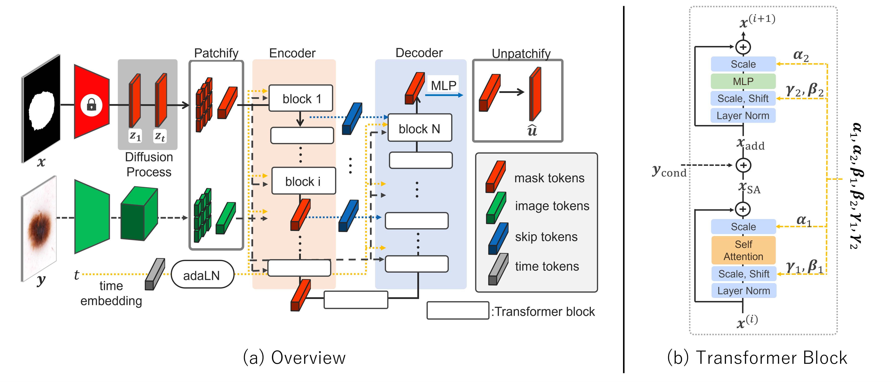

<!-- <p align="center">
  
</p> -->


# <div align="center"> Efficient Medical Image Segmentation with Rectifed Flow-Based Diffusion Transformer<div> 
### <div align="center"> ICONIP 2025 poster <div> 
<div align="center">

  <!-- Paper (Springer) -->
  <a href="https://link.springer.com/chapter/10.1007/978-981-95-4100-3_1">
    
  </a> &ensp;

  <!-- DOI -->
  <a href="https://doi.org/10.1007/978-981-95-4100-3_1">
    
  </a> &ensp;

  <!-- Code -->
  <a href="https://github.com/kato0116/Efficient_Medical_Image_Segmentation_with_RF-Based_Diffusion_Transformer">
    
  </a>

</div>

> [**Efficient Medical Image Segmentation with Rectifed Flow-Based Diffusion Transformer**](https://link.springer.com/chapter/10.1007/978-981-95-4100-3_1)<br>
> [Shunichi Kato](https://scholar.google.co.jp/citations?user=EeT3vBcAAAAJ&hl=ja), [Masaki Nishimura](https://scholar.google.co.jp/citations?user=Uel-5SgAAAAJ&hl=ja&oi=sra), 
> Takaya Ueda, Yu Song,
> [Ikuko Nishikawa](https://scholar.google.co.jp/citations?view_op=list_works&hl=ja&hl=ja&user=cWumpokAAAAJ&pagesize=80);,
> <br>Ritsumeikan University<br>


## Model overview


## Requirement
Python >= 3.8.16
```bash
pip install -r requirement.txt
```
## TODO LIST

- [ ] Release REFUGE and DDIT dataloaders and examples
- [ ] Sample and Vis in training
- [ ] Release pre processing and post processing
- [ ] Deploy on HuggingFace


## Cite
Please cite
~~~
@inproceedings{kato2025efficient,
  title={Efficient Medical Image Segmentation with Rectified Flow-Based Diffusion Transformer},
  author={Kato, Shunichi and Nishimura, Masaki and Ueda, Takaya and Song, Yu and Nishikawa, Ikuko},
  booktitle={International Conference on Neural Information Processing},
  pages={3--16},
  year={2025},
  organization={Springer}
}
~~~


